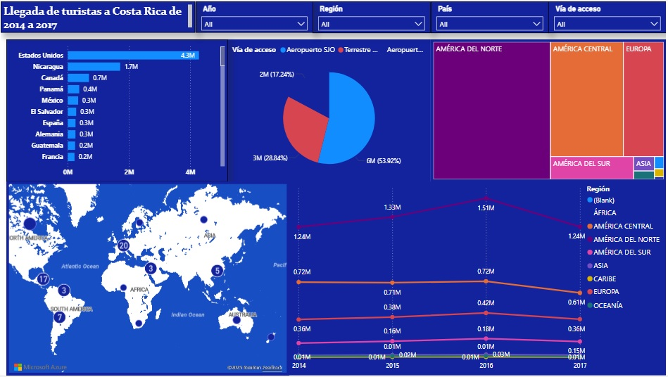

# Llegada de turistas a Costa Rica (2014–2017)

## Descripción
Dashboard analítico e interactivo que muestra la llegada de turistas a Costa Rica durante el periodo 2014–2017. La solución permite analizar el comportamiento del turismo por **país de origen**, **región geográfica**, **vía de acceso** y **tendencia anual**, integrando visualizaciones comparativas y geográficas en una sola vista.

## Problema
La información turística se encontraba distribuida en tablas estáticas, lo que dificultaba:
- Identificar los principales países emisores.
- Analizar tendencias de crecimiento por región y año.
- Comparar la relevancia de cada vía de acceso.
- Comunicar hallazgos de forma clara y visual a tomadores de decisión.

## Solución
Desarrollo de un dashboard interactivo que consolida los datos históricos y permite la exploración dinámica mediante filtros por **año**, **región**, **país** y **vía de acceso**, facilitando el análisis estratégico del flujo turístico.

## Dataset
- **Periodo:** 2014 – 2017  
- **Granularidad:** Llegadas anuales de turistas  
- **Dimensiones:**  
  - País de origen  
  - Región (América del Norte, Central, Sur, Europa, Asia, etc.)  
  - Vía de acceso  
  - Año  
- **Origen:** Datos estadísticos oficiales de turismo

## Procesos aplicados
- Extracción y consolidación de datos históricos  
- Limpieza y normalización de categorías  
- Validación de consistencia temporal y totales  
- Modelado de datos para análisis multidimensional  
- Cálculo de métricas agregadas y porcentajes  
- Diseño de visualizaciones interactivas

## Indicadores clave (KPIs)
- Total de llegadas por país  
- Participación por región  
- Distribución por vía de acceso  
- Evolución anual de llegadas  
- Concentración geográfica del turismo

## Resultados
- Identificación de **Estados Unidos** como principal país emisor.  
- Visibilidad del peso de **América del Norte** en el total de llegadas.  
- Comparación clara del crecimiento anual por región.  
- Mejora en la toma de decisiones estratégicas relacionadas con promoción turística e infraestructura.

## Herramientas
- Excel / Power BI  
- Gráficos interactivos  
- Mapas geográficos

## Screenshot  

  

  

## Archivo  

[Ver <i>online</i>](https://app.powerbi.com/links/a-sLBJjO0q?ctid=907b52e3-1016-4302-8183-b7228ca70197&pbi_source=linkShare)  
[Descargar archivo](LlegadaDeTuristas.pbix)

## [← Regresar a Proyectos/Power BI](../PowerBI/index.md)
