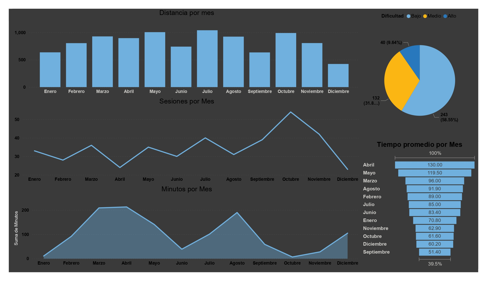

# Análisis de rendimiento en ciclismo – SQL + Excel + Power BI
## Descripción
Proyecto de análisis de datos personales de ciclismo basado en registros históricos de entrenamiento.
Los datos fueron extraídos de Strava, limpiados en Excel y almacenados en una base de datos SQLite para su análisis mediante SQL y posterior visualización en Excel.

## Objetivo
Analizar el volumen, la consistencia y el rendimiento del entrenamiento a lo largo del tiempo, evaluando distancia, duración, esfuerzo y dificultad de las sesiones para identificar patrones y oportunidades de mejora.

## Dataset
Fuente: Strava  
Base de datos: SQLite  
Tabla: RENDIMIENTO_2025  
Variables clave: fecha, mes, ruta, distancia, tiempo, altimetría, esfuerzo, dificultad
Periodo: 2025

## Procesos aplicados
Limpieza y estandarización de datos en Excel
Carga y modelado en base de datos SQLite
Definición de métricas mediante consultas SQL
Agregación temporal y análisis descriptivo
Exportación de resultados para visualización

## Consultas SQL
Las consultas se encuentran documentadas en la carpeta /queries e incluyen:
- Volumen mensual de entrenamiento
- Tiempo total y promedio por periodo
- Análisis por ruta
- Relación dificultad–esfuerzo
- Ranking de sesiones
- Métricas resumen
- Visualización
## Los resultados de las consultas SQL se consumen en Excel para:
- Gráficas de tendencia mensual
- Rankings por ruta
- Indicadores resumen
- Análisis comparativo
 
## Herramientas
- Excel
- SQLite (DB Browser for SQLite)
- SQL
- Power BI

## Conclusiones
El análisis permitió identificar patrones de entrenamiento, rutas más frecuentes y sesiones de mayor carga, proporcionando una base objetiva para evaluar rendimiento y consistencia a lo largo del tiempo.

## Capturas de pantalla
#Consultas SQL

  
  

  
  
  

  
  
  

  
  # Gráficas en Excel
  

  
  

  
  

  
# Dashboard Power BI  

  
## Archivos
rendimiento.bdd  
rendimineto.sql

## Regresar a .../proyectos/SQL
